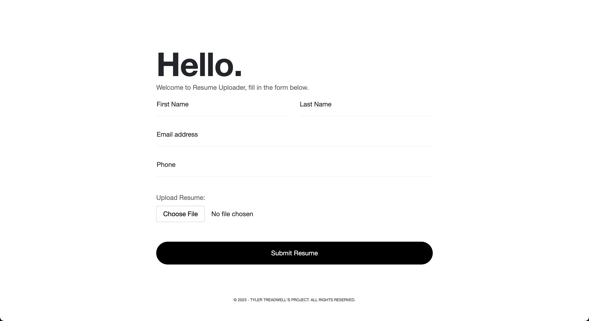

# Resume Uploader





### Overview

This project aims to simplify the process of submitting resumes through a contact form. It provides a user-friendly interface for candidates to submit their resumes, making it easy for you to collect and manage applications.

### Features

- **Contact Form:** An intuitive contact form for users to submit their resumes.
- **Resume Upload:** Allows users to attach their resumes directly through the form.
- **Validation:** Implements form validation to ensure accurate and complete submissions.
- **Notification:** Receive email notifications upon each resume submission.
- **Database Integration:** Stores submitted resumes securely in a database for easy retrieval.

### Requirements
- **Resend API KEY:** https://resend.com/login?redirectedFrom=%2Fapi-keys

### Installation

1. **Clone the Repository:**
   ```bash
   git clone https://github.com/your-username/your-project.git
   
2. **Startup local php server:**
   ```bash
   php -S localhost:9000
   
2. **Create .env file in includes dir :**
   ```bash
   RESEND_KEY=re_XXXXXXXXXXXXXXXXXXXXXXXXXX
